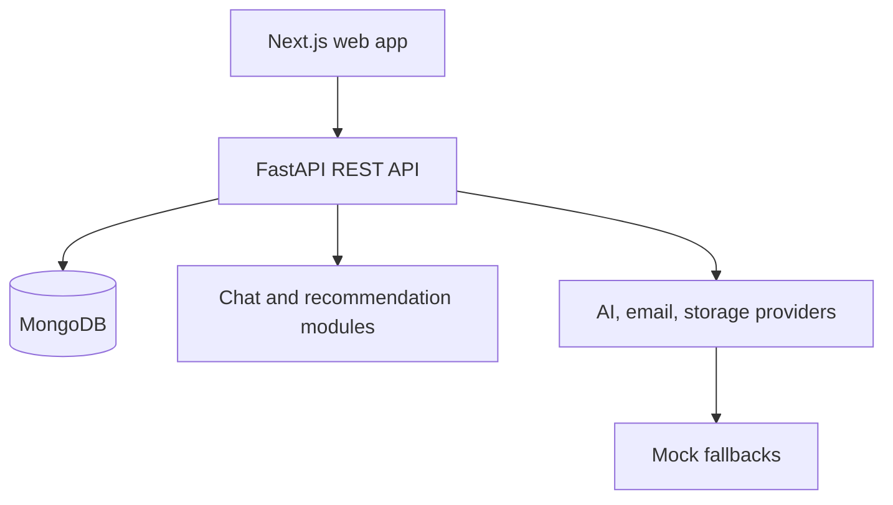

# Architecture

## Decision

The reconstruction uses a modular monolith: a Next.js TypeScript frontend, a FastAPI Python backend, and MongoDB. This preserves the report's service boundaries without inventing operationally expensive microservices, queues, or serverless infrastructure.

## Backend modules

- `auth`: registration, login, JWT, reset-token lifecycle, authorization dependencies.
- `users`: identity and user profile.
- `profiles`: financial profile and goals.
- `chat`: preprocessing, intent/entity extraction, rule engine, AI provider orchestration.
- `recommendations`: deterministic financial calculations and explainable heuristics.
- `history`: user-owned conversations/messages and pagination.
- `notifications`: email interface, SMTP adapter, mock delivery and event log.
- `storage`: storage interface, Cloudinary adapter, mock metadata adapter.
- `admin`: privacy-limited service summary.

## Request flow

1. The frontend obtains a JWT through registration/login and keeps it in client state/storage for this reconstruction.
2. Authenticated API requests resolve the current user and role.
3. Chat requests run deterministic intent/entity parsing or an `AIProvider`.
4. Financial arithmetic always runs in `recommendations`, never in an LLM.
5. The response and metadata are saved to a user-owned conversation.
6. MongoDB queries include the current user identifier; ownership tests cover cross-user access attempts.

## Runtime modes

- Normal development: MongoDB plus mock AI/email/storage.
- External integrations: selected by environment variables and activated only when all required credentials are present.
- Test: isolated in-memory repository with the same repository contracts, avoiding external network dependencies.

## Security boundaries

- Passwords use an adaptive hash; reset tokens are stored as hashes and expire.
- JWT secrets and provider credentials are environment-only.
- Pydantic validates API input; uploads have allowlists and size limits.
- CORS is restricted to configured frontend origins.
- User-scoped repositories prevent insecure direct-object references.
- Logs avoid tokens, passwords, full financial profiles, and message contents.

## Report differences

The report names microservices, event-driven systems, RabbitMQ/SQS, serverless functions, transactions, multiple languages, SQL, and cloud deployments without evidence of a coherent deployed implementation. These are treated as aspirational descriptions. The modular monolith is a documented reconstruction decision.

